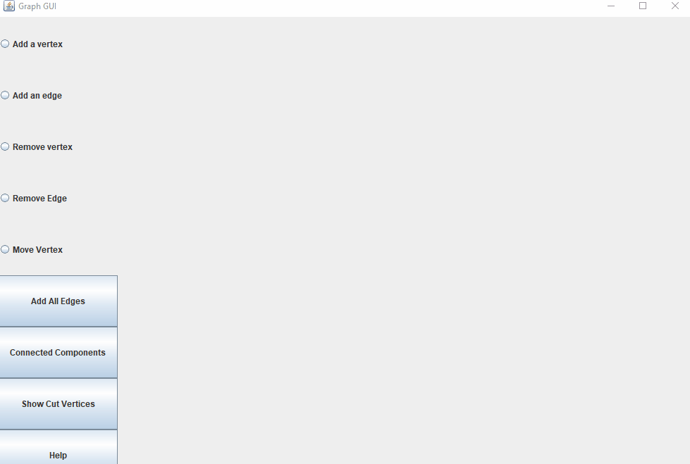

# Graph GUI

> A visualization of the Graph's Data structure and some graph algorithms using Java Swing.

## Contents
* [Requirements](#Requirements)
* [Features](#Features)
* [Demo](#Demo)
* [How To Use](#How-To-Use)
* [Requirements](#Requirements)

## Requirements

In order to run this application, you must have the latest version of Java installed. Runs on all operating systems.

## Features
* Add vertices and edges to the screen to construct multiple graphs
* Remove any vertex or edge at any constructed graph
* Add edges to all vertices that are on the screen
* Color in the separate graphs on the screen
* Show the vertices that will create separate connected components if removed from any graph

## Demo

